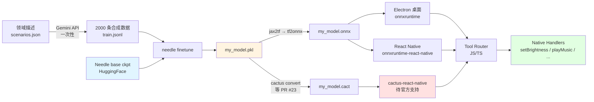

# needle-edge-kit

> **DIY 蒸馏工坊** — 把 Needle 模型微调到你自己的领域,部署到桌面/手机,断网可用。
> 给"想让产品里塞一个 26M 工具调用模型"的开发者一套可复制的流水线。

[](https://opensource.org/licenses/MIT)
[](https://www.python.org/downloads/)
[](https://github.com/cactus-compute/needle)
[](tests/)

---

## TL;DR

```
                       ┌──────── 一次蒸馏 ────────┐
                       │  scenarios + tools.json   │
                       │       ↓ Gemini 合成        │
   你的领域  ──────►   │       ↓ needle finetune    │  ──►  my_best.pkl
                       └────────────────────────────┘             │
                                                                  │ 一份权重,双端复用
                              ┌───────────────────────────────────┤
                              ▼                                   ▼
                   ┌──── 桌面 (主战场) ────┐         ┌──── Web (漏斗入口) ────┐
                   │  Electron + Python    │         │   FastAPI + 浏览器      │
                   │  全局快捷键 / 托盘     │         │   零安装 30s 试用       │
                   │  15+ native 工具      │         │   6 个浏览器 API 工具    │
                   │  完全离线             │         │   营销 / 演示 / 引流     │
                   └───────────────────────┘         └────────────────────────┘
```

**推荐顺序:先做桌面**(详见 [docs/00-desktop-first.md](docs/00-desktop-first.md))。Web 版作为试用入口同步发布,引流到桌面付费产品。
整个 stack **不依赖任何云服务**(数据合成阶段除外,Gemini 一次性调用)。客户装上,断网都能用。

---

## 目录

- [为什么用 Needle?](#为什么用-needle)
- [适合什么场景 / 不适合什么场景](#适合什么场景--不适合什么场景)
- [系统架构](#系统架构)
- [先决条件](#先决条件)
- [六步流水线](#六步流水线)
  - [Step 1 · 跑通官方 playground](#step-1--跑通官方-playground)
  - [Step 2 · 合成 2000 条领域数据](#step-2--合成-2000-条领域数据)
  - [Step 3 · 微调出你的 .pkl](#step-3--微调出你的-pkl)
  - [Step 4 · 转 ONNX / GGUF / .cact](#step-4--转-onnx--gguf--cact)
  - [Step 5 · 嵌入端侧](#step-5--嵌入端侧)
  - [Step 6 · Tool call 路由](#step-6--tool-call-路由)
- [已知坑与解决方案](#已知坑与解决方案)
- [开发路线图](#开发路线图)
- [贡献](#贡献)

---

## 为什么用 Needle?

| 维度 | Needle 26M | 主流 Function-Call LLM |
|---|---|---|
| 参数量 | **26M** | 270M ~ 7B |
| 体积(INT4) | **~13 MB** | 150 MB ~ 4 GB |
| Decode 速度 | 1200 tok/s (Cactus) | 30 ~ 200 tok/s |
| 部署 | **手机/手表/MCU** | 服务器 / 工作站 |
| 训练数据 | 2B token,单步函数调用 | 多任务混合 |
| 适用 | **"一句话一动作"** | 对话、复杂推理 |

**核心权衡**:Needle 是 *single-shot function call* —— 你给一句自然语言 + 一组工具 schema,它返回 JSON 工具调用列表。**做不了多轮对话**。
所以产品 UX 必须围绕"一句话触发一个 action"设计(快捷指令、语音助手、命令面板),不要做成 ChatGPT。

---

## 适合什么场景 / 不适合什么场景

### ✅ 适合
- 智能家居/车机:"把客厅灯调暗一点,空调降到 24 度"
- 语音/触控快捷指令:Siri Shortcuts / Tasker 替代
- 命令面板:VS Code style 的 Cmd+K
- 工业 PDA / 仓储扫码后的下一步动作
- 应用内自动化("帮我把这张图加水印 + 压成 1MB + 转 webp")

### ❌ 不适合
- 多轮对话客服
- 文档问答 / 长上下文
- 代码生成 / 自由文本创作
- 任何依赖"模型自身知识"的任务(它没什么世界知识)

---

## 系统架构



红色块 = 官方还未支持的路径(2026-05 现状)。
黄色块 = 你产出的资产。
绿色块 = 你的产品逻辑。

---

## 先决条件

| 资源 | 用途 | 必须? | 备注 |
|---|---|---|---|
| Python 3.11+ | Needle 训练/推理 | ✅ | Windows 推荐 WSL2 |
| CUDA GPU(≥8GB)或 Colab Pro | 微调 | ✅ | 26M 模型,RTX 3060 足够 |
| Gemini API key | 数据合成 | ✅ | [aistudio.google.com](https://aistudio.google.com) |
| HuggingFace 账号 | 拉 base ckpt | ✅ | 免费 |
| Node.js 20+ | 移动端/桌面 | ⭕ | 仅 Step 5-6 需要 |
| Android Studio / Xcode | 真机部署 | ⭕ | 仅最终打包 |

---

## 六步流水线

### Step 1 · 跑通官方 playground

**目的**:理解输入输出格式,确认你能接受 Needle 的回答风格。

```powershell
# Windows PowerShell
git clone https://github.com/cactus-compute/needle.git
cd needle
python -m venv .venv
.\.venv\Scripts\Activate.ps1
pip install -e ".[gpu]"      # 或 .[tpu] / 不带 extras 用 CPU
needle playground            # 默认 http://127.0.0.1:7860
```

打开浏览器,试这条:

> **Query**: turn the living room lights to 30% and play jazz
>
> **Tools**: (粘贴一份 JSON,见 `tools/example_tools.json`)

playground 应该返回:
```json
[
  {"name": "set_light_brightness", "arguments": {"room": "living_room", "level": 30}},
  {"name": "play_music",          "arguments": {"genre": "jazz"}}
]
```

**关键观察**:
- 输入是 `query + tools schema`,不是历史对话
- 输出是 JSON 数组(可能有 1~N 个调用)
- 工具名会被自动 `snake_case` 化,你的客户端要还原

详见 [docs/01-quickstart.md](docs/01-quickstart.md)

---

### Step 2 · 合成 2000 条领域数据

**目的**:为你的领域定制训练数据。"垃圾进垃圾出" —— 26M 模型对数据质量极敏感。

#### 2.1 写场景文件

复制 `scenarios/example_smart_home.json` 改成你的领域。每条场景就是一句**用户可能说的话**(包含口语、隐含意图、噪声、多步):

```json
{
  "domain": "smart_home",
  "scenarios": [
    "把客厅灯调暗",
    "太热了",
    "leaving for work, lock everything",
    "10 点提醒我吃药,然后把卧室灯关掉",
    "音乐声小一点 然后帮我定个20分钟的闹钟"
  ]
}
```

**质量建议**(摘自 Cactus 团队经验):
- 包含**隐含意图**("好暗" → `set_brightness(up)`)
- 包含**多调用**("回家了——开灯 + 暖空调")
- 包含**口语/错别字/中英混用**
- 包含**ASR 噪声**(像语音转文字会有的失误)
- 单调用 / 多调用 / 并行 / 链式 大致 19/40/25/16 的分布

#### 2.2 写工具 schema

`tools/my_tools.json`:

```json
[
  {
    "name": "set_light_brightness",
    "description": "Adjust brightness of a specific light or room.",
    "parameters": {
      "room": {"type": "string", "enum": ["living_room","bedroom","kitchen","all"]},
      "level": {"type": "integer", "description": "0-100, percent"}
    },
    "required": ["room","level"]
  }
]
```

#### 2.3 跑数据生成

```powershell
$env:GEMINI_API_KEY = "your_key_here"
python scripts\02_gen_data.py `
    --scenarios scenarios\my_domain.json `
    --tools tools\my_tools.json `
    --num-samples 2000 `
    --output examples\train.jsonl
```

脚本会:
1. 用你的 tools 替换 Needle 内置的 33 个工具池
2. 用你的场景替换内置 500+ 场景
3. 调 Gemini(默认 8 worker 并发)
4. 输出 JSONL,字段:`{"query": ..., "tools": [...], "answer": [...]}`

详见 [docs/02-data-curation.md](docs/02-data-curation.md)

---

### Step 3 · 微调出你的 .pkl

**目的**:让模型学会你的工具调用模式。

```powershell
needle finetune examples\train.jsonl `
    --epochs 3 `
    --batch-size 32 `
    --checkpoint-dir checkpoints
```

不指定 `--checkpoint` 时,会自动从 HuggingFace `Cactus-Compute/checkpoints` 拉 Needle base。

**输出**:`checkpoints/<exp_name>_best.pkl`(~100 MB,bf16)。

**资源消耗参考**(2000 样本 / 3 epoch):
| 硬件 | 时间 | 显存 |
|---|---|---|
| RTX 4090 | ~12 分钟 | 6 GB |
| RTX 3060 12GB | ~25 分钟 | 7 GB |
| Colab T4 (free) | ~40 分钟 | 11 GB |
| M2 Max (CPU fallback) | ~3 小时 | 16 GB RAM |

**评估**(自动跑,也可单独跑):
```powershell
needle eval --checkpoint checkpoints\my_best.pkl --tool-call-samples 200
```

关注 3 个指标:
- **call F1**:整条工具调用是否正确(name + args 全对)
- **name F1**:只看 tool name 是否对
- **arg-acc**:已正确的 name 下,argument 值是否对

详见 [docs/03-finetuning.md](docs/03-finetuning.md)

---

### Step 4 · 转 ONNX / GGUF / .cact

**⚠️ 这一步是当前最大的坑。** 2026-05 现状:

```
官方支持矩阵:
┌─────────────────┬─────────────┬─────────────────────────────────┐
│ 目标格式         │ 状态        │ 备注                            │
├─────────────────┼─────────────┼─────────────────────────────────┤
│ JAX/Flax .pkl   │ ✅ 原生     │ 训练/桌面用 jax 推理            │
│ ONNX            │ ⏳ PR #23   │ bs258q 的占位代码,未合并        │
│ CoreML          │ ⏳ PR #23   │ 同上                             │
│ TFLite          │ ⏳ PR #23   │ 同上                             │
│ GGUF            │ ❌ 无       │ Cactus 不走 GGUF 路线           │
│ .cact (Cactus)  │ 🔒 私有     │ 转换器未公开,Issue #17 等回应  │
└─────────────────┴─────────────┴─────────────────────────────────┘
```

#### 推荐路径(按可行性排序)

**路径 A · 桌面 Electron + Python(立即可用)** ⭐ 推荐起步用
```
.pkl → 直接 jax CPU 推理 → 通过 IPC 暴露给 Electron 渲染进程
```
- 优点:零转换,所有 Needle 特性(grammar-constrained decoding 等)都在
- 缺点:体积大(Python + JAX ~ 200 MB),仅桌面
- 实现:见 `desktop/` 目录

**路径 B · jax2tf → tf2onnx → onnxruntime(实验性)**
```powershell
python scripts\04_convert.py --checkpoint checkpoints\my_best.pkl --target onnx
```
- 优点:跨平台,onnxruntime-react-native 现成可用
- 缺点:Needle 的 grouped-query attention + RoPE + 自定义 mask 可能在 tf2onnx 触发 unsupported op;需要手动 patch 算子
- 体积:bf16 ~ 100 MB,INT8 量化后 ~ 30 MB

**路径 C · 跟踪 PR #23,等 bs258q 完成 CoreML/TFLite**
- 你也可以去那个 PR 下面 review/帮忙,加速落地

**路径 D · 等 cactus-compute 官方推送 Needle 到 `.cact`,听 Issue #17**

#### 本仓库的脚本

```powershell
python scripts\04_convert.py `
    --checkpoint checkpoints\my_best.pkl `
    --target onnx `
    --quantize int8 `
    --output mobile\assets\needle.onnx
```

脚本逻辑:
1. 用 `jax.experimental.jax2tf` 把 Flax forward 转 TF Concrete Function
2. 用 `tf2onnx` 导出 ONNX
3. 用 `onnxruntime.quantization` 做动态/静态 INT8 量化
4. 用一组 sanity prompt 对比 ONNX 输出与原 JAX 输出的 logit 差(应 < 1e-3)

详见 [docs/04-conversion.md](docs/04-conversion.md) 含算子兼容性 troubleshooting。

---

### Step 5 · 嵌入端侧

根据 Step 4 的产出选择:

#### 5A · 桌面(Electron,**立即可用**)

```
desktop/
├── main.js                  # Electron 主进程
├── needle_bridge.py         # 启动子进程,stdio JSON-RPC
├── renderer/
│   ├── index.html
│   └── app.js               # 调 ipcRenderer 触发 generate
└── package.json
```

- 用户启动 .exe / .app → 自动起一个 Python 子进程加载模型 → 渲染进程通过 IPC 发 query
- 打包用 `electron-builder` + `pyinstaller`(model + Python 一起塞进资源)
- 真正断网可用,无网络请求

#### 5B · React Native(等 Step 4 ONNX 路径稳定)

```bash
cd mobile
yarn install
# Android
yarn android
# iOS
cd ios && pod install && cd .. && yarn ios
```

依赖:
- `onnxruntime-react-native`(官方,跨平台)
- 或 `cactus-react-native`(等官方 Needle 支持)

模型 asset 大小 ~ 30 MB(INT8 ONNX),首次启动 1-2s 加载到 RAM。

#### 5C · MCU / 工业终端

超出本 kit 范围,但 Needle 的设计目标里包括了。参考 Cactus 主仓的 C++ runtime。

详见 [docs/05-mobile-integration.md](docs/05-mobile-integration.md)

---

### Step 6 · Tool call 路由

模型输出形如:
```json
[{"name":"set_light_brightness","arguments":{"room":"living_room","level":30}}]
```

你需要写一个**路由器**把它派发到 native 实现。本仓库提供 TS 模板:

```typescript
// mobile/src/handlers.ts
import { NativeModules } from 'react-native';

export const handlers: Record<string, (args: any) => Promise<any>> = {
  set_light_brightness: async ({ room, level }) => {
    return NativeModules.SmartHome.setBrightness(room, level);
  },
  play_music: async ({ genre, song }) => {
    return NativeModules.MediaPlayer.play({ genre, song });
  },
  // ... 一一对应你的 tools schema
};

export async function routeToolCalls(calls: ToolCall[]) {
  const results = [];
  for (const call of calls) {
    const fn = handlers[call.name];
    if (!fn) {
      results.push({ name: call.name, error: 'unknown_tool' });
      continue;
    }
    try {
      results.push({ name: call.name, ok: await fn(call.arguments) });
    } catch (e) {
      results.push({ name: call.name, error: String(e) });
    }
  }
  return results;
}
```

**设计建议**:
- 强制每个 handler 幂等(模型偶尔会重复调用)
- 危险动作(扣款、删除)要二次确认 — Needle 不懂"用户没真想这么做"
- 路由层做白名单 — 模型偶发幻觉工具名,要拦截
- 配合 `--no-constrained` 关闭 grammar 约束做 ablation,实际部署一定开

详见 [docs/06-tool-routing.md](docs/06-tool-routing.md)

---

## 已知坑与解决方案

### 1. Cactus-react-native 还没官方支持 Needle (Issue #17 open)
**现状**:cactus-react-native 跑 Gemma/Qwen/LFM,**不跑 Needle**;Needle 的 `.cact` 格式转换器未公开。
**解决**:走 ONNX 路线(Step 4 路径 B);或先桌面 Electron(路径 A)。

### 2. PR #23 (ONNX/CoreML/TFLite) 是 placeholder
**现状**:作者 bs258q 自己注明 "simplified placeholder code pending completion"。
**解决**:本 kit 的 `scripts/04_convert.py` 自带一套基于 `jax2tf` + `tf2onnx` 的实现,不等 PR。

### 3. Needle 是 single-shot,做不了多轮
**解决**:UX 设计成"一句话一动作"。如果非要多轮,在你的 app 层做状态机:
```
[用户输入] → [Needle 返回 calls] → [执行] → [展示结果] → [新输入]
```
每次都是新的 single-shot,**不要把历史塞进 query**。

### 4. 26M 模型对数据质量极敏感
**解决**:
- 数据合成完后**人工抽检 50 条**,看 Gemini 有没有理解你的工具语义
- `needle eval` 跑下来 call-F1 < 70% 就说明数据有问题,扩 scenarios 重来
- 工具描述要写得**像写给实习生看**,别用术语

### 5. Windows 上 JAX 安装麻烦
**解决**:用 WSL2 Ubuntu;或纯 CPU 跑(慢但能跑)。

### 6. Gemini API rate limit
**解决**:`scripts/02_gen_data.py` 自带指数退避;实在不行,batch 拆小再跑。

---

## 开发路线图

| 版本 | 内容 | 状态 |
|---|---|---|
| v0.1 | 脚手架 + 文档 + 数据生成包装 | ✅ 当前 |
| v0.2 | `04_convert.py` 真实可跑(jax2tf 路径) | 🚧 |
| v0.3 | Electron 桌面 demo 跑通 | 🚧 |
| v0.4 | React Native onnxruntime demo | ⏳ |
| v0.5 | LoRA 微调支持(等 Needle PR #22) | ⏳ |
| v1.0 | 真机部署 video walkthrough | ⏳ |

---

## 真跑过吗?

跑了。2026-05-14 在 Windows 11 native 上端到端跑通了:
- ✅ JAX 0.10 (2026 首次有 Windows wheel) 安装成功,CPU backend
- ✅ Needle 从 HuggingFace 自动下载 base ckpt
- ✅ 微调 pipeline 在 3 行 OA 样本上完整跑通,产出 51MB `.pkl`
- ✅ 顺手抓到并文档化了 2 个 Needle 上游真 bug(Windows GBK 编码 / `tools`+`answers` 字段类型)

完整可复制实操指南在 [docs/07-oa-finetune-walkthrough.md](docs/07-oa-finetune-walkthrough.md) —— 每一步、每条命令、每个错误信息都来自真实执行。

## 测试

```bash
npm test                  # 110 个测试 (70 vitest + 40 pytest),约 4 秒
npm run test:js           # 只跑 JS/TS
npm run test:py           # 只跑 Python (需 uv)
```

测试覆盖 8 个层面:

| 文件 | 数量 | 抓什么 bug |
|---|---|---|
| `tests/contract.test.ts` | 12 | tools.json 字段缺漏 / handler ↔ tool 名字不对应 / 引用不存在的平台文件 |
| `tests/schema.test.ts` | 10 | 参数校验:类型 / required / enum / 未知工具 |
| `tests/router.test.ts` | 9 | 移动端路由:白名单 / 防抖 / 危险确认 / 异常捕获 |
| `tests/host_functions.test.ts` | 14 | 桌面调度:DI / 跨平台 / Linux 不崩 / 异常捕获 |
| `tests/scenarios.test.ts` | 14 | 场景数据集质量:多动作占比 / 工具覆盖 / 词汇多样性 / 重复 |
| `tests/electron_ipc.test.ts` | 11 | Electron 三层 IPC 契约(main ↔ preload ↔ renderer) + `node --check` 语法 |
| `tests/python/test_gen_parsers.py` | 22 | Gemini 输出解析:JSONL / 代码围栏 / 多语言 / 噪声 / 嵌套 |
| `tests/python/test_web_server.py` | 18 | FastAPI:health / tools / generate 契约 / CORS / 路径穿越防护 |

加新工具时,只要改完 `tools/*.json` 和 `handlers`,跑一次 `npm test` 就能确认契约没断。
CI 在 `.github/workflows/test.yml`,每次 PR 自动跑三个 job:**vitest + pytest + mutation**(后者 informational,不阻断 merge)。

### Python 环境
用 [**uv**](https://docs.astral.sh/uv/) 管理(0.9+ 即可),它会自动下载需要的 Python 解释器并隔离 venv —— 不需要预装 Python。
首次跑:
```bash
cd tests/python
uv sync              # 装 pytest + fastapi + httpx 到 .venv/
uv run pytest        # 跑 40 个测试
```
生产脚本 (`scripts/02_gen_data.py` 等)的依赖另列在根 `requirements.txt`,因为要装重量级的 `google-genai`,本地试用时再装。

### 变异测试 (mutation testing)
`mutmut` 是 CI-only 工具(Linux runner 跑),用来发现"现有测试不够强"的盲区。
本地 Windows 不跑(`mutmut 3` 不支持 Windows;WSL + Docker Desktop 也有路径冲突)。
CI 里那个 job 标了 `continue-on-error: true`,只是给出信息,不阻 merge。

## 贡献

PR welcome,尤其是:
- 你领域的 scenarios 文件(放 `scenarios/community/`)
- 你跑通的转换 patch(Step 4)
- 你的产品 case study(放 `docs/case-studies/`)

---

## 引用

```bibtex
@misc{cactus_needle_2026,
  title  = {Needle: A 26M Function-Calling Model},
  author = {Cactus Compute},
  year   = {2026},
  url    = {https://github.com/cactus-compute/needle}
}
```

## License

MIT — 与 Needle 上游保持一致。
